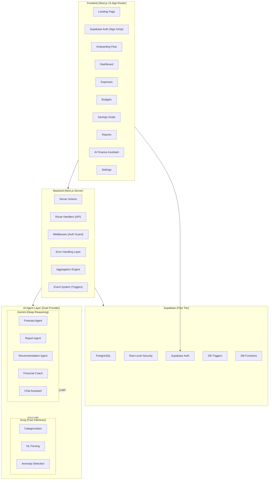

# Cresco — System Architecture

```mermaid
graph TB
    subgraph Client["Frontend (Next.js 15 App Router)"]
        LP["Landing Page"]
        Auth["Supabase Auth (Sign In/Up)"]
        OB["Onboarding Flow"]
        Dash["Dashboard"]
        Exp["Expenses"]
        Budg["Budgets"]
        Goals["Savings Goals"]
        Reports["Reports"]
        Chat["AI Finance Assistant"]
        Settings["Settings"]
    end

    subgraph Server["Backend (Next.js Server)"]
        SA["Server Actions"]
        RH["Route Handlers (API)"]
        MW["Middleware (Auth Guard)"]
        EH["Error Handling Layer"]
        AGG["Aggregation Engine"]
        EVT["Event System (Triggers)"]
    end

    subgraph AI["AI Agent Layer (Dual Provider)"]
        direction LR
        subgraph Fast["Groq (Fast Inference)"]
            CAT["Categorization"]
            NLP["NL Parsing"]
            ANO["Anomaly Detection"]
        end
        subgraph Deep["Gemini (Deep Reasoning)"]
            FOR["Forecast Agent"]
            REP["Report Agent"]
            REC["Recommendation Agent"]
            COACH["Financial Coach"]
            CHAT_AI["Chat Assistant"]
        end
    end

    subgraph Data["Supabase (Free Tier)"]
        PG["PostgreSQL"]
        RLS["Row-Level Security"]
        AUTH["Supabase Auth"]
        TRIG["DB Triggers"]
        FUNC["DB Functions"]
    end

    Client --> Server
    Server --> AI
    Server --> Data
    AI --> |"Groq API"| Fast
    AI --> |"Gemini API"| Deep
    Client --> AUTH
```
