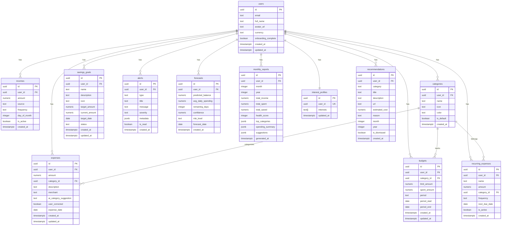

# Cresco — Database Entity Relationship Diagram

```mermaid
erDiagram
    users ||--o{ incomes : has
    users ||--o{ categories : has
    users ||--o{ expenses : has
    users ||--o{ budgets : has
    users ||--o{ savings_goals : has
    users ||--o{ alerts : has
    users ||--o{ forecasts : has
    users ||--o{ monthly_reports : has
    users ||--o{ recurring_expenses : has
    users ||--|| interest_profiles : has
    users ||--o{ recommendations : has
    categories ||--o{ expenses : categorizes
    categories ||--o{ budgets : tracks
    categories ||--o{ recurring_expenses : belongs

    users {
        uuid id PK
        text email
        text full_name
        text avatar_url
        text currency
        boolean onboarding_complete
        timestamptz created_at
        timestamptz updated_at
    }

    incomes {
        uuid id PK
        uuid user_id FK
        numeric amount
        text source
        text frequency
        integer day_of_month
        boolean is_active
        timestamptz created_at
    }

    categories {
        uuid id PK
        uuid user_id FK
        text name
        text icon
        text color
        boolean is_default
        timestamptz created_at
    }

    expenses {
        uuid id PK
        uuid user_id FK
        numeric amount
        uuid category_id FK
        text description
        text merchant
        text ai_category_suggestion
        boolean user_corrected
        date expense_date
        timestamptz created_at
        timestamptz updated_at
    }

    budgets {
        uuid id PK
        uuid user_id FK
        uuid category_id FK
        numeric limit_amount
        numeric spent_amount
        text period
        date period_start
        date period_end
        timestamptz created_at
        timestamptz updated_at
    }

    savings_goals {
        uuid id PK
        uuid user_id FK
        text name
        text description
        text icon
        numeric target_amount
        numeric current_amount
        date target_date
        text status
        timestamptz created_at
        timestamptz updated_at
    }

    alerts {
        uuid id PK
        uuid user_id FK
        text type
        text title
        text message
        text severity
        jsonb metadata
        boolean is_read
        timestamptz created_at
    }

    forecasts {
        uuid id PK
        uuid user_id FK
        numeric predicted_balance
        numeric avg_daily_spending
        integer remaining_days
        numeric confidence
        text risk_level
        date forecast_date
        timestamptz created_at
    }

    monthly_reports {
        uuid id PK
        uuid user_id FK
        integer month
        integer year
        numeric total_income
        numeric total_spent
        numeric total_saved
        integer health_score
        jsonb top_categories
        jsonb spending_summary
        jsonb suggestions
        timestamptz generated_at
    }

    recurring_expenses {
        uuid id PK
        uuid user_id FK
        text name
        numeric amount
        uuid category_id FK
        text frequency
        date next_due_date
        boolean is_active
        timestamptz created_at
    }

    interest_profiles {
        uuid id PK
        uuid user_id UK
        text[] interests
        timestamptz updated_at
    }

    recommendations {
        uuid id PK
        uuid user_id FK
        text category
        text title
        text description
        text url
        numeric estimated_cost
        text reason
        integer month
        integer year
        boolean is_dismissed
        timestamptz created_at
    }
```
