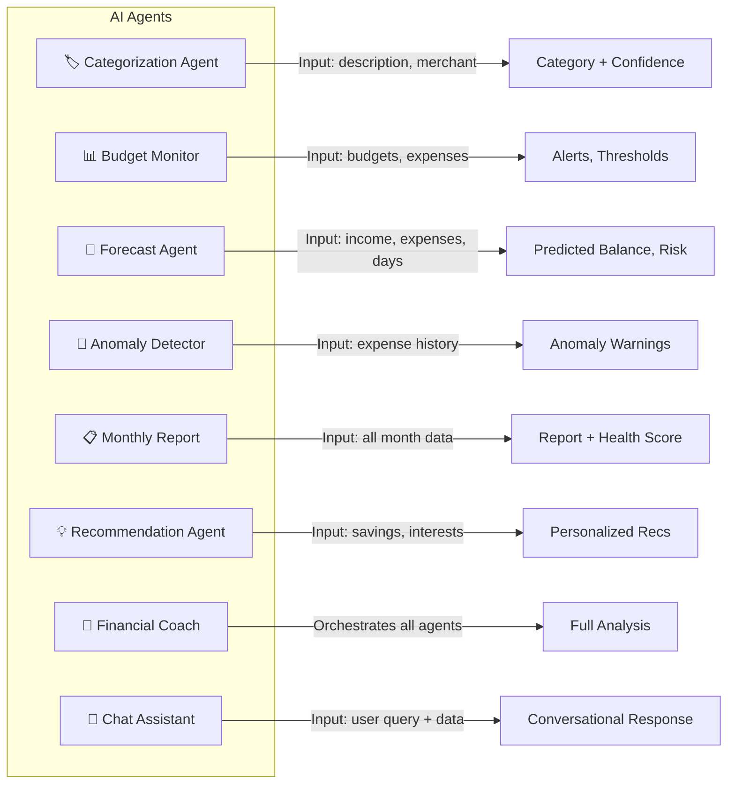
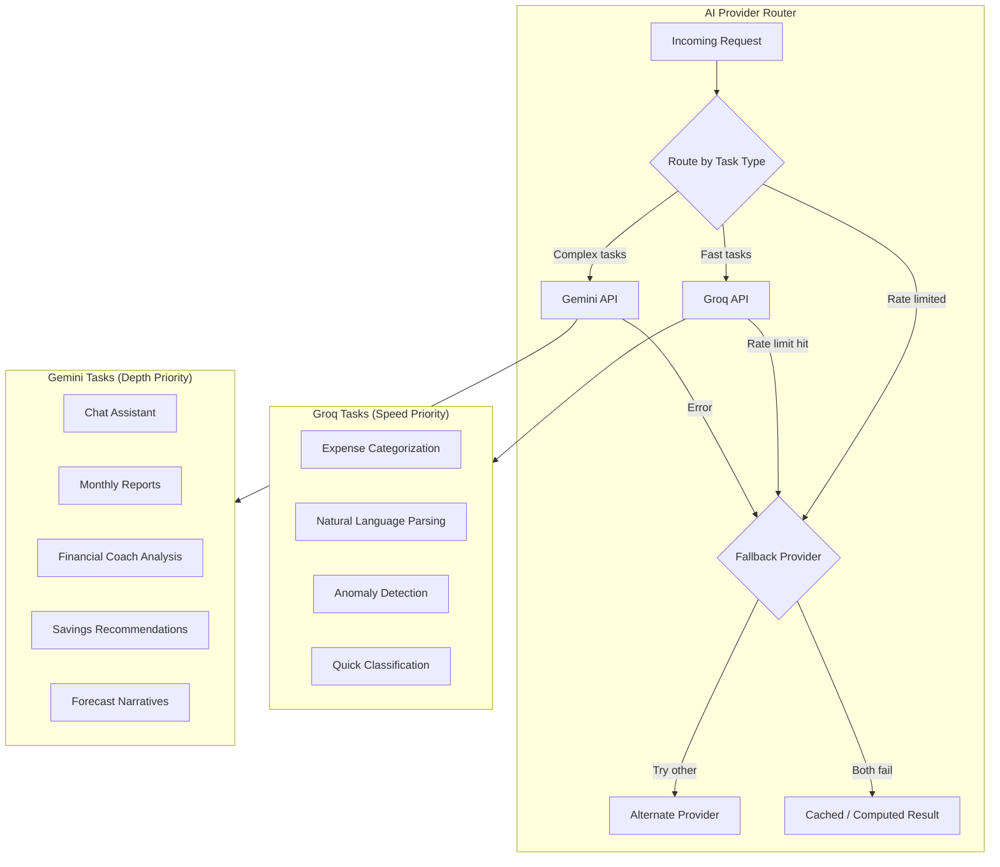
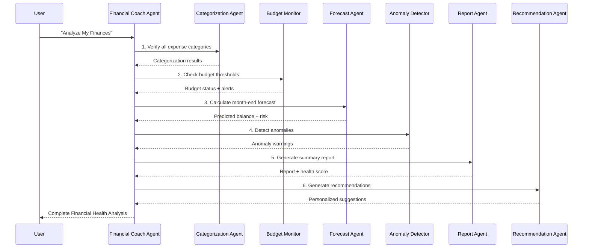

# Cresco — AI Agent Architecture

```mermaid
graph LR
    subgraph Agents["AI Agents"]
        CAT["🏷️ Categorization Agent"]
        BM["📊 Budget Monitor"]
        FA["🔮 Forecast Agent"]
        AD["🚨 Anomaly Detector"]
        MR["📋 Monthly Report"]
        RA["💡 Recommendation Agent"]
        FC["🤖 Financial Coach"]
        CA["💬 Chat Assistant"]
    end

    CAT -->|"Input: description, merchant"| CAT_OUT["Category + Confidence"]
    BM -->|"Input: budgets, expenses"| BM_OUT["Alerts, Thresholds"]
    FA -->|"Input: income, expenses, days"| FA_OUT["Predicted Balance, Risk"]
    AD -->|"Input: expense history"| AD_OUT["Anomaly Warnings"]
    MR -->|"Input: all month data"| MR_OUT["Report + Health Score"]
    RA -->|"Input: savings, interests"| RA_OUT["Personalized Recs"]
    FC -->|"Orchestrates all agents"| FC_OUT["Full Analysis"]
    CA -->|"Input: user query + data"| CA_OUT["Conversational Response"]
```

## AI Provider Assignment

```mermaid
graph TD
    subgraph Provider["AI Provider Router"]
        REQ["Incoming Request"] --> ROUTER{"Route by Task Type"}
        
        ROUTER -->|"Fast tasks"| GROQ["Groq API"]
        ROUTER -->|"Complex tasks"| GEMINI["Gemini API"]
        ROUTER -->|"Rate limited"| FALLBACK{"Fallback Provider"}
        
        GROQ -->|"Rate limit hit"| FALLBACK
        GEMINI -->|"Error"| FALLBACK
        FALLBACK -->|"Try other"| ALT["Alternate Provider"]
        FALLBACK -->|"Both fail"| CACHE["Cached / Computed Result"]
    end

    subgraph GroqTasks["Groq Tasks (Speed Priority)"]
        G1["Expense Categorization"]
        G2["Natural Language Parsing"]
        G3["Anomaly Detection"]
        G4["Quick Classification"]
    end

    subgraph GeminiTasks["Gemini Tasks (Depth Priority)"]
        M1["Chat Assistant"]
        M2["Monthly Reports"]
        M3["Financial Coach Analysis"]
        M4["Savings Recommendations"]
        M5["Forecast Narratives"]
    end

    GROQ --> GroqTasks
    GEMINI --> GeminiTasks
```

## Financial Coach Orchestration

```mermaid
sequenceDiagram
    participant User
    participant Coach as Financial Coach Agent
    participant Cat as Categorization Agent
    participant Bud as Budget Monitor
    participant Fore as Forecast Agent
    participant Anom as Anomaly Detector
    participant Rep as Report Agent
    participant Rec as Recommendation Agent

    User->>Coach: "Analyze My Finances"
    
    Coach->>Cat: 1. Verify all expense categories
    Cat-->>Coach: Categorization results
    
    Coach->>Bud: 2. Check budget thresholds
    Bud-->>Coach: Budget status + alerts
    
    Coach->>Fore: 3. Calculate month-end forecast
    Fore-->>Coach: Predicted balance + risk
    
    Coach->>Anom: 4. Detect anomalies
    Anom-->>Coach: Anomaly warnings
    
    Coach->>Rep: 5. Generate summary report
    Rep-->>Coach: Report + health score
    
    Coach->>Rec: 6. Generate recommendations
    Rec-->>Coach: Personalized suggestions
    
    Coach-->>User: Complete Financial Health Analysis
```
