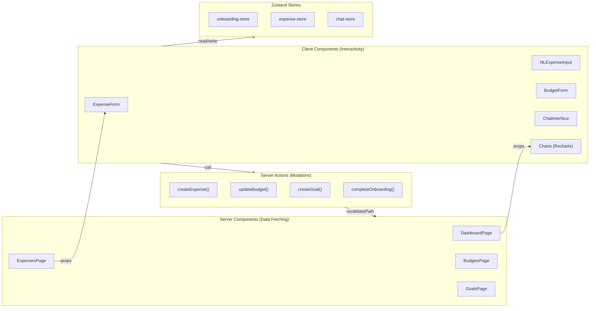

# Cresco — Component Hierarchy

```mermaid
graph TD
    RootLayout["RootLayout\n(ThemeProvider, Supabase Provider)"]

    RootLayout --> LandingPage
    RootLayout --> AuthLayout
    RootLayout --> AppLayout

    LandingPage --> Navbar
    LandingPage --> Hero
    LandingPage --> Problem
    LandingPage --> Features
    LandingPage --> AICapabilities
    LandingPage --> SavingsUnlock
    LandingPage --> Testimonials
    LandingPage --> CTA
    LandingPage --> Footer

    AuthLayout --> LoginPage
    AuthLayout --> SignupPage

    AppLayout --> Sidebar
    AppLayout --> Header
    AppLayout --> MobileNav
    AppLayout --> MainContent

    MainContent --> OnboardingPage
    MainContent --> DashboardPage
    MainContent --> ExpensesPage
    MainContent --> BudgetsPage
    MainContent --> GoalsPage
    MainContent --> ReportsPage
    MainContent --> AssistantPage
    MainContent --> SettingsPage

    DashboardPage --> MetricCards
    DashboardPage --> CategoryPieChart
    DashboardPage --> SpendingTrend
    DashboardPage --> BudgetUtilization
    DashboardPage --> RecentExpenses
    DashboardPage --> AlertsPanel
    DashboardPage --> AIInsights
    DashboardPage --> SavingsOpportunities

    ExpensesPage --> NLExpenseInput
    ExpensesPage --> ExpenseForm
    ExpensesPage --> ExpenseTable
    ExpensesPage --> ExpenseFilters

    BudgetsPage --> BudgetCard
    BudgetsPage --> BudgetForm
    BudgetsPage --> BudgetProgress

    GoalsPage --> GoalCard
    GoalsPage --> GoalForm
    GoalsPage --> GoalProgress

    ReportsPage --> MonthlyReport
    ReportsPage --> HealthScore

    AssistantPage --> ChatInterface
    ChatInterface --> ChatMessage
    ChatInterface --> SuggestedPrompts

    OnboardingPage --> IncomeStep
    OnboardingPage --> CategoriesStep
    OnboardingPage --> GoalsStep
    OnboardingPage --> InterestsStep
```

## Page-Level Data Flow

```mermaid
flowchart LR
    subgraph ServerComponents["Server Components (Data Fetching)"]
        DP["DashboardPage"]
        EP["ExpensesPage"]
        BP["BudgetsPage"]
        GP["GoalsPage"]
    end

    subgraph ServerActions["Server Actions (Mutations)"]
        CE["createExpense()"]
        UB["updateBudget()"]
        CG["createGoal()"]
        CO["completeOnboarding()"]
    end

    subgraph ClientComponents["Client Components (Interactivity)"]
        EF["ExpenseForm"]
        NL["NLExpenseInput"]
        BF["BudgetForm"]
        CI["ChatInterface"]
        Charts["Charts (Recharts)"]
    end

    subgraph Stores["Zustand Stores"]
        OS["onboarding-store"]
        ES["expense-store"]
        CS["chat-store"]
    end

    DP -->|"props"| Charts
    EP -->|"props"| EF
    ClientComponents -->|"call"| ServerActions
    ClientComponents -->|"read/write"| Stores
    ServerActions -->|"revalidatePath"| ServerComponents
```
