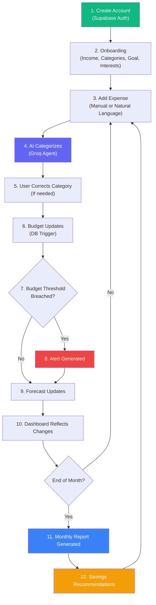
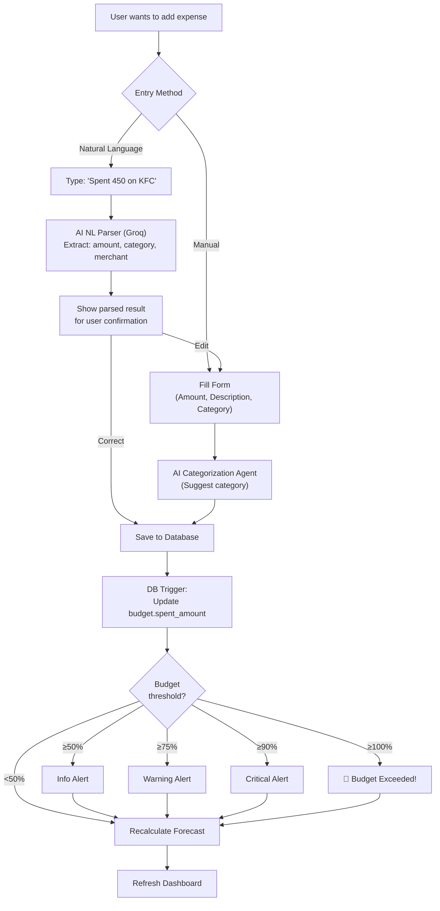
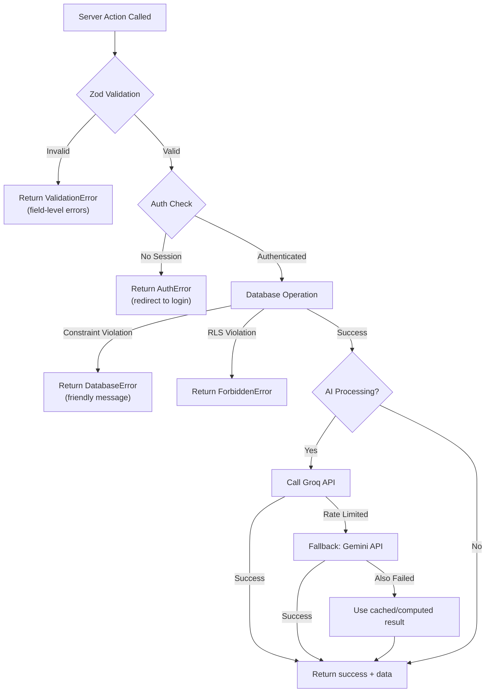

# Cresco — User Flow & MVP Workflow

## MVP Workflow (Production-Ready First)

```mermaid
flowchart TD
    A["1. Create Account\n(Supabase Auth)"] --> B["2. Onboarding\n(Income, Categories, Goal, Interests)"]
    B --> C["3. Add Expense\n(Manual or Natural Language)"]
    C --> D["4. AI Categorizes\n(Groq Agent)"]
    D --> E["5. User Corrects Category\n(If needed)"]
    E --> F["6. Budget Updates\n(DB Trigger)"]
    F --> G{"7. Budget Threshold\nBreached?"}
    G -->|"Yes"| H["8. Alert Generated"]
    G -->|"No"| I["9. Forecast Updates"]
    H --> I
    I --> J["10. Dashboard Reflects Changes"]
    J --> K{"End of Month?"}
    K -->|"Yes"| L["11. Monthly Report Generated"]
    L --> M["12. Savings Recommendations"]
    K -->|"No"| C
    M --> C

    style A fill:#10b981,color:#fff
    style D fill:#6366f1,color:#fff
    style H fill:#ef4444,color:#fff
    style L fill:#3b82f6,color:#fff
    style M fill:#f59e0b,color:#fff
```

## Onboarding Flow

```mermaid
flowchart LR
    S1["Step 1\n💰 Monthly Income"] --> S2["Step 2\n📂 Budget Categories"]
    S2 --> S3["Step 3\n🎯 Savings Goal"]
    S3 --> S4["Step 4\n🎨 Select Interests"]
    S4 --> DONE["✅ Dashboard"]

    style S1 fill:#10b981,color:#fff
    style S2 fill:#10b981,color:#fff
    style S3 fill:#10b981,color:#fff
    style S4 fill:#10b981,color:#fff
    style DONE fill:#059669,color:#fff
```

## Expense Entry Flow

```mermaid
flowchart TD
    START["User wants to add expense"] --> CHOICE{"Entry Method"}
    
    CHOICE -->|"Manual"| FORM["Fill Form\n(Amount, Description, Category)"]
    CHOICE -->|"Natural Language"| NL["Type: 'Spent 450 on KFC'"]
    
    NL --> PARSE["AI NL Parser (Groq)\nExtract: amount, category, merchant"]
    PARSE --> CONFIRM["Show parsed result\nfor user confirmation"]
    CONFIRM -->|"Correct"| SAVE
    CONFIRM -->|"Edit"| FORM
    
    FORM --> AICAT["AI Categorization Agent\n(Suggest category)"]
    AICAT --> SAVE["Save to Database"]
    
    SAVE --> TRIGGER["DB Trigger:\nUpdate budget.spent_amount"]
    TRIGGER --> CHECK{"Budget\nthreshold?"}
    
    CHECK -->|"≥50%"| ALERT_INFO["Info Alert"]
    CHECK -->|"≥75%"| ALERT_WARN["Warning Alert"]
    CHECK -->|"≥90%"| ALERT_CRIT["Critical Alert"]
    CHECK -->|"≥100%"| ALERT_OVER["🚨 Budget Exceeded!"]
    CHECK -->|"<50%"| FORECAST
    
    ALERT_INFO --> FORECAST
    ALERT_WARN --> FORECAST
    ALERT_CRIT --> FORECAST
    ALERT_OVER --> FORECAST
    
    FORECAST["Recalculate Forecast"]
    FORECAST --> DONE["Refresh Dashboard"]
```

## Error Handling Flow

```mermaid
flowchart TD
    ACTION["Server Action Called"] --> VALIDATE{"Zod Validation"}
    VALIDATE -->|"Invalid"| VERR["Return ValidationError\n(field-level errors)"]
    VALIDATE -->|"Valid"| AUTH{"Auth Check"}
    AUTH -->|"No Session"| AERR["Return AuthError\n(redirect to login)"]
    AUTH -->|"Authenticated"| DB["Database Operation"]
    DB -->|"Constraint Violation"| DERR["Return DatabaseError\n(friendly message)"]
    DB -->|"RLS Violation"| FERR["Return ForbiddenError"]
    DB -->|"Success"| AI{"AI Processing?"}
    AI -->|"Yes"| GROQ["Call Groq API"]
    GROQ -->|"Rate Limited"| GEMINI["Fallback: Gemini API"]
    GEMINI -->|"Also Failed"| CACHE["Use cached/computed result"]
    GROQ -->|"Success"| OK["Return success + data"]
    GEMINI -->|"Success"| OK
    CACHE --> OK
    AI -->|"No"| OK
```
